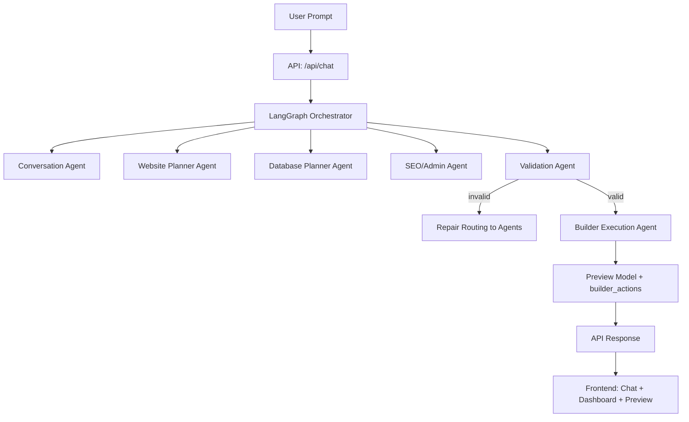
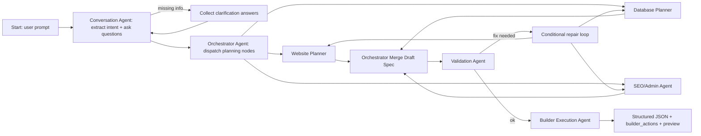
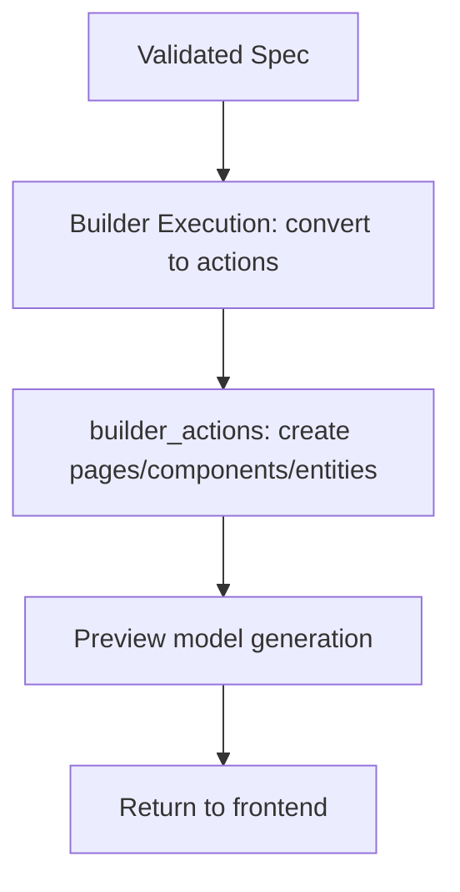

# AI Multi-Agent Drag-and-Drop Website Builder (LangGraph + FastAPI)

## Problem Statement
Design a practical AI multi-agent system that takes a high-level natural language request (e.g., “Create an ecommerce website…”) and produces a structured website-building plan suitable for a drag-and-drop website builder. The system must:
- Understand intent and extract requirements
- Ask follow-up questions when information is missing
- Break large requests into smaller planning tasks
- Generate structured JSON outputs (pages/components/entities/admin/SEO)
- Validate completeness and dependencies using explicit rules
- Convert validated plans into builder actions and a simple preview
- Orchestrate the above using a LangGraph workflow with reliable validation loops

> This repo focuses on AI orchestration and planning/validation pipelines (not complex frontend/drag-drop UX).

## Repository Structure
```
project-root/
│
├── frontend/
│   ├── (Next.js app)
│
├── backend/
│   ├── agents/
│   ├── orchestrator/
│   ├── validators/
│   ├── schemas/
│   ├── workflows/
│   └── api/
│
├── diagrams/
│   ├── architecture.mmd
│   ├── multi_agent_workflow.mmd
│   ├── validation_pipeline.mmd
│   └── builder_execution_flow.mmd
│
├── docs/
│   └── (optional notes)
│
└── README.md
```

## High-Level Architecture
The backend runs a LangGraph state machine. Each node uses a dedicated “agent” function (LLM-backed where configured; deterministic fallbacks for robustness) to:
1. Extract requirements + ask clarifications
2. Produce an initial website plan (pages/components/navigation/user flows)
3. Produce a data model (entities/relationships/CMS structures)
4. Produce SEO + admin features
5. Validate the plan for completeness + rule-based dependencies
6. If invalid, route back to the appropriate agent(s) with targeted repair instructions
7. Produce builder actions and a preview model

### Mermaid Diagrams (single-file)
The project originally stored diagrams as separate `.mmd` files. For a single-file, submission-friendly README, all diagrams are embedded below.

#### Architecture


#### Planning Workflow


#### Validation Pipeline
```mermaid
flowchart TD
  D[Draft Spec (JSON)] --> CV[Validation: schema + rules]
  CV --> R1{Dependencies satisfied?}
  R1 -->|no| MISS[Identify missing dependencies]
  MISS --> FIX[Repair instructions]
  FIX --> LOOP[Route to agents for targeted fixes]
  LOOP --> D
  R1 -->|yes| CON[Assign confidence scores]
  CON --> OUT[Validated Spec]
```

#### Builder Execution Flow



## Agent Responsibilities
1. **Conversation Agent**
   - Extracts intent (website type, goals)
   - Detects missing info and proposes clarification questions

2. **Orchestrator Agent**
   - Coordinates workflow state transitions
   - Merges partial outputs into a single draft “website spec”

3. **Website Planner Agent**
   - Generates pages, components, navigation, user flows

4. **Database Planner Agent**
   - Generates entities/relationships suitable for a builder backend/CMS

5. **SEO/Admin Agent**
   - Generates SEO metadata/sitemap planning
   - Plans admin/auth features and CMS management

6. **Validation Agent**
   - Applies explicit validation rules (ecommerce/payment/admin dependency checks)
   - Produces confidence scores and suggested fixes
   - Drives the repair loop when requirements are missing

7. **Builder Execution Agent**
   - Converts the validated spec into “builder_actions”
   - Produces a lightweight preview representation

## Workflow Lifecycle
**User Prompt → Understanding → Clarification Questions → Planning → Validation → Builder Action Generation → Website Preview**

## Validation Strategy (Key Rules)
Implemented with explicit rule checks over the structured plan.

Examples:
- If **payment exists** ⇒ checkout required; order entity required
- If **ecommerce** ⇒ product entity required; inventory required
- If **admin panel exists** ⇒ authentication required

The validator returns:
- `is_valid` boolean
- `missing` items
- `dependency_issues`
- `confidence` scores
- `repair_instructions` for the orchestrator/agents

## Scalability
- LangGraph makes it easy to extend:
  - Add new website types (restaurant/portfolio/booking/SaaS/blog)
  - Add more agents (e.g., payments provider integration)
  - Add more validators (security, performance budgets)
- State and partial outputs are stored/passed as structured JSON.

## Technical Decisions (Summary)
- **FastAPI**: clean API boundaries for chat, planning, and rendering
- **LangGraph**: deterministic control flow with conditional routing and loops
- **Pydantic**: enforce structured schemas for planner outputs
- **SQLite**: store conversations + generated specs/actions for auditability

## Setup Instructions
### 1) Backend
```bash
cd backend
python -m venv .venv
source .venv/bin/activate
pip install -r requirements.txt

# (Optional) set OpenAI key
export OPENAI_API_KEY="..."

uvicorn app.main:app --reload --port 8000
```

### 2) Frontend
```bash
cd frontend
npm install
npm run dev --port 3000
```

### 3) Try the demo
- Open frontend at http://localhost:3000
- Submit a prompt like:
  > “Create an ecommerce website for my clothing brand with product listing, cart, checkout, payment integration, inventory management, offers, admin panel, and SEO support.”

## What This Prototype Demonstrates
- Multi-agent orchestration via LangGraph
- Intent understanding + required clarifications
- Structured JSON planning outputs (pages/components/entities/admin/SEO)
- Rule-based validation with explicit dependency checks
- Builder action generation + simple preview model

## System Design / Architecture
### Responsibilities (agents)
- **Conversation Agent** (`conversation_agent`): infers website type and creates clarification questions + requirement flags.
- **Website Planner Agent** (`website_planner_agent`): generates the **page/routes** and **UI component plan**.
- **Database Planner Agent** (`database_planner_agent`): generates entities/relationships/CMS structure.
- **SEO/Admin Agent** (`seo_admin_agent`): generates `seo` and `admin_features` (e.g., authentication + CMS).
- **Validation Agent** (`validation_agent` + `validation_engine.py`): applies explicit rules to determine completeness and dependencies.
- **Builder Execution Agent** (`builder_execution_agent`): converts the validated spec into `builder_actions` and `preview`.

### Data flow
LangGraph passes a single `BuilderState` object through nodes:
`user_prompt → conversation → spec → validation → builder_actions/preview → API response`.

## Planning Workflow (end-to-end)
Lifecycle:
1. **User Prompt**
2. **Understanding** (`conversation_agent`)
   - infer intent (ecommerce/general)
   - detect feature flags: payment + admin panel
3. **Planning**
   - **Website planning** (`website_planner_agent`): generates page/routes + UI components + basic user flows
   - **Database planning** (`database_planner_agent`): generates entities/relationships/CMS collections
   - **SEO/Admin planning** (`seo_admin_agent`): generates `seo` + `admin_features`
4. **Validation** (`validation_agent` → `validation_engine.validate_spec`)
   - checks dependencies using explicit rules
   - returns `is_valid`, `missing`, `dependency_issues`, `repair_instructions`, and confidence
5. **Execution** (`builder_execution_agent`)
   - converts the validated spec into `builder_actions` and a `preview` model


## Reasoning Approach
- **Deterministic fallbacks**: keyword-based requirement inference keeps the system testable without an LLM.
- **Explicit rules**: validation checks for dependency satisfaction (e.g., ecommerce ⇒ Product/Inventory/Cart; payment ⇒ checkout + Order).
- **Repair routing hook**: graph is structured so it can route to targeted agents in future (currently it always proceeds to execution after validation pass).
- **Context maintenance**: all intermediate outputs live in `BuilderState` and are read/written by each node.

## Technical Decisions
- **FastAPI**: simple boundary for `POST /api/chat` and consistent JSON responses.
- **LangGraph**: state-machine orchestration with deterministic ordering and future repair-loop support.
- **Pydantic**: schema-driven request/response + typed shared state (`BuilderState`).
- **Rule-based validation**: avoids hallucination by requiring concrete plan elements (pages/entities) before execution.

## Notes / Next Steps
Once implemented, you can run:
- backend unit tests (if added)
- a scripted demo request to validate end-to-end correctness


---

## Prototype Demo Checklist (End-to-end)
This repo already includes the full LangGraph wiring and deterministic fallback agents.
To confirm it works on your machine, start the backend and call the API.

### 1) Start backend
```bash
cd backend
python -m venv .venv
source .venv/bin/activate
pip install -r requirements.txt
uvicorn app.main:app --reload --port 8000
```

### 2) Test the planning + validation + execution pipeline
Run (in a new terminal):
```bash
curl -s -X POST http://localhost:8000/api/chat \
  -H "Content-Type: application/json" \
  -d '{"user_prompt":"Create an ecommerce website for my clothing brand with product listing, cart, checkout, Stripe payment, inventory management, offers, admin panel, and SEO support."}' \
| python -m json.tool
```

### 3) Expected result shape
The response includes:
- `spec`: generated draft plan (pages/components/entities/seo/admin_features)
- `validated`: `is_valid`, `missing`, `dependency_issues`, `confidence`
- `builder_actions`: simulated actions like `create_page` and `create_entity`
- `preview.cards`: basic preview cards for pages

### Known prototype limitation (important)
This prototype is intentionally lightweight: it uses deterministic keyword inference in `conversation_agent` and a rule-based `validation_engine`. It generates a minimal set of ecommerce pages/components and CMS entities, and it does not implement real payment/provider integration or a UI drag-and-drop renderer.


